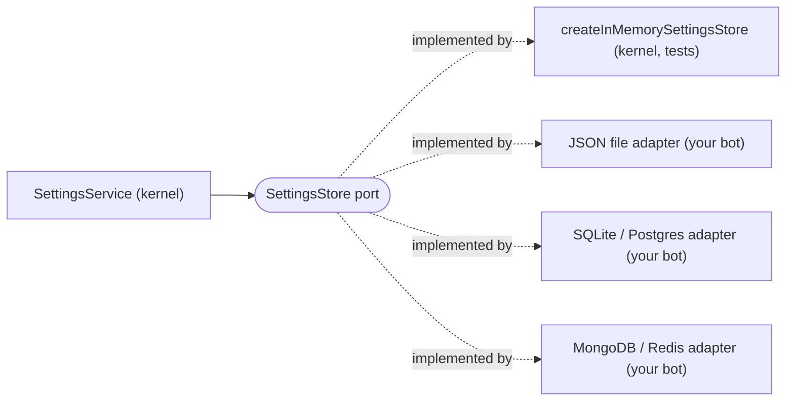

# @azurioh/discord-kernel

The framework half of a Discord bot, without the bot: a command DSL, guards,
interaction routing, composed components, localisation, and the ports an
application implements. It knows discord.js and nothing else — no database, no
logger implementation, no opinion about what your bot does.

Built for Clean Architecture with vertically-sliced feature modules: the kernel
is the innermost ring, and the fact that it is a package rather than a folder is
what enforces that — an outer ring simply is not in its dependency graph.

```bash
pnpm add @azurioh/discord-kernel discord.js
```

`discord.js` is a **peer dependency**, never a dependency: two copies of the
library in one tree would break every `instanceof` the gateway relies on.

## What is in it

| Area | What it gives you |
| ---- | ----------------- |
| `discord/command/` | `createCommand` (flat or grouped), typed options, guards (`allOf`/`anyOf`, permissions, roles, cooldowns), the per-interaction `Context`, autocomplete, the `CommandRouter` |
| `discord/interaction/` | `createButton`, `createModal`, the four typed select menus (`createStringSelect`, `createChannelSelect`, `createRoleSelect`, `createUserSelect`), the `InteractionRouter`/`InteractionDispatcher` seam |
| `discord/components/` | `ComponentRouter` for persistent `customId` routing, and collector-backed screens: `paginator`, `interactive-message`, `settings-editor` |
| `discord/events/` | `createEvent` and the `EventRouter` — the one place `client.on` is called |
| `discord/ui/` | Embeds with Discord's size limits handled, `createCard` containers, a configurable palette, a colour-input parser |
| `i18n/` | Catalogs (`{ en, fr? }`, `en` mandatory), a registry that fails the boot on a duplicate key, per-interaction locale resolution |
| `authz/` | An `Authorizer` port with `viewer`/`editor` grants and a `requireLevel` guard |
| `errors/` | `BusinessError` and friends, carrying an optional translation key beside the English source |
| `scheduler/` | A `Scheduler` port and a node-cron implementation |
| Ports | `Logger`, `DatabaseConnection`, `Presenter`, `Clock`, `ChannelExporter` — declared here, implemented by your app |

Every path is imported directly; there is no root barrel:

```ts
import { createCommand } from "@azurioh/discord-kernel/discord/command/create-command";
import type { Logger } from "@azurioh/discord-kernel/logger";
import { type Catalog, createTranslator } from "@azurioh/discord-kernel/i18n";
```

## What is deliberately not in it

- **A database.** `DatabaseConnection` is a lifecycle port — connect, close — and
  nothing more. Query APIs differ too much between engines to abstract usefully,
  so an adapter exposes its own and your repositories are the only code that
  touches it.
- **A logger.** `Logger` is a port; pino, Sentry or `console` live in your app.
- **A configuration shape.** The kernel ships env-reading primitives
  (`requireEnv`, `enumEnv`, …); which keys exist is your composition root's call.
- **A palette.** Embeds render in Discord's blurple until you say otherwise, so a
  bot never starts out wearing someone else's identity.

## Storage adapters

Settings persistence is hexagonal: the kernel declares the `SettingsStore` port
and never imports a database driver. Each database sits behind an adapter your
bot owns, and the composition root picks one at boot.



The port has three methods: `read`, `write` and `delete`. It stores one
`StoredSettings` record per `(guildId, moduleId)`, and every field of a record
is JSON-serialisable. An adapter must honour these guarantees:

| Guarantee | Meaning |
| --------- | ------- |
| A missing record reads as `null` | `read` returns `null` until the first write and after a delete |
| Atomic compare-and-set | `write` lands only if the stored revision equals `expectedRevision` (`null` means no record yet), checked and applied in one atomic step, so of two writers holding the same revision exactly one wins |
| Conflicts change nothing | A mismatch throws the kernel's `ConflictError` and leaves the stored record as it was. Any other failure is thrown as it is, never as a conflict |
| Isolation | One `(guildId, moduleId)` never reads, overwrites or deletes another |
| Idempotent delete | Deleting a missing record succeeds |
| Independent copies | The store keeps no reference to the record it was given and hands out none it keeps |
| Faithful round-trip | `read` returns a record equal to the one written (JSON values, `updatedBy` absent stays absent) |

### Writing an adapter for any database

The only hard part is the compare-and-set. Use the native primitive that checks
and writes in one step, never a read followed by a write:

- **SQL (Postgres, MySQL, SQLite):** a table keyed `(guild_id, module_id)`. A create
  is `INSERT ... ON CONFLICT DO NOTHING` and an update is
  `UPDATE ... WHERE guild_id = ? AND module_id = ? AND revision = ?`. Zero affected
  rows means `ConflictError`. The sandbox bot's `src/shared/settings/sqlite/` is a
  worked example.
- **MongoDB:** one document per key with a unique index on `{ guildId, moduleId }`.
  An update is `findOneAndUpdate({ guildId, moduleId, revision: expected }, { $set: record })`,
  where no match means a conflict. A create is `insertOne`, where a duplicate-key error
  (code 11000) means a conflict.
- **Redis:** one key per record. Either `WATCH key`, `GET`, compare, then
  `MULTI`/`SET`/`EXEC`, where a nil `EXEC` means a conflict, or a Lua script that
  compares the stored revision and sets the key atomically.

Then prove the adapter with the contract suite. It is runner-agnostic: pass it
your runner's `describe`, `it` and `expect`, and a factory that returns an empty store:

```ts
// tests/postgres-settings-store.test.ts
import { runSettingsStoreContract } from "@azurioh/discord-kernel/settings/testing";
import { afterAll, describe, expect, it } from "vitest";
import { createPostgresSettingsStore } from "../src/postgres-settings-store";
import { createTestDatabase } from "./support/test-database";

const database = await createTestDatabase(); // one fresh schema per run
afterAll(() => database.drop());

runSettingsStoreContract(() => createPostgresSettingsStore(database.freshTable()), { describe, it, expect });
```

Every guarantee in the table has a case in the suite, including two concurrent
writers with the same revision.

## Making it yours

Two things are global by nature — a bot has one look, decided once — and are set
from the composition root before any module is constructed:

```ts
import { configureEmbedColors } from "@azurioh/discord-kernel/discord/ui/colors";
import { registerColorAliases } from "@azurioh/discord-kernel/discord/ui/color-aliases";

configureEmbedColors({ brand: 0xf3c909 });
registerColorAliases({ gold: "#f3c909", or: "#f3c909" });
```

Everything else is injected: your modules are factories receiving a container
you define, so nothing in the kernel is reachable as a singleton.

## Per-guild values

A value the kernel uses when it answers an interaction is read through a
resolver port, per guild, never from a global. The bot passes a default
implementation built from its own configuration, and any module can replace it
with its own. Today that value is the reply language:

```ts
import { createGuildLocaleResolver } from "@azurioh/discord-kernel/discord/settings/guild-locale-resolver";

// Member locale → guild language setting → guild Discord locale → translator default.
const localeResolver = createGuildLocaleResolver({ service: settings, registry, translator });
const commands = new CommandRouter({ presenter, logger, translator, localeResolver });
const components = new ComponentRouter({ presenter, logger, translator, localeResolver });
```

Any object implementing `LocaleResolver`
(`@azurioh/discord-kernel/discord/interaction/locale-resolver`) fits:
`{ resolve({ locale, guildLocale, guildId }) => Promise<Locale> }`. Without one,
the routers keep the interaction's own locales, so a bot without settings is
unaffected. A resolver that throws is logged and the interaction's own locales
are used.

## Evolving module settings

Adding a field needs nothing: guilds configured before read its default.
Removing one needs nothing either: its stored value is ignored and dropped on
the next write. To reshape stored values (rename a key, change a unit), raise
the declaration's `version` and give it a `migrate`:

```ts
export const warnings = defineSettings({
  id: "warnings",
  version: 2, // was 1: `maxWarnings` became `warnLimit`
  migrate: (fromVersion, raw) => {
    if (fromVersion !== 1) throw new Error(`no migration from version ${fromVersion}`);
    const { maxWarnings, ...rest } = raw as Record<string, unknown>;
    return maxWarnings === undefined ? rest : { ...rest, warnLimit: maxWarnings };
  },
  labels: { title: "warnings.title" },
  fields: { warnLimit: field.integer({ label: "warnings.limit", min: 1, max: 10, default: 3 }) },
});
```

Migration is lazy: the first read of a guild's older record runs `migrate`,
validates the result like any stored value, and writes it back once under the
new version (a concurrent reader on another shard loses the compare-and-set and
simply reads the migrated record). `set` and `reset` migrate first too. Rules for
`migrate`:

- **Pure.** It receives a copy of the stored values and returns the new ones;
  no I/O, no clock, no randomness.
- **Every older version.** A guild may skip releases, so `fromVersion` can be
  any version below the current one. Chain the steps (v1 → v2 → v3) or throw
  for a version you no longer support.
- **Failures are safe.** When it throws or its result fails validation, nothing
  is written, the error is logged with the guild, module and versions, and the
  guild reads defaults for the fields it cannot read. A record written by a
  newer version (after a rollback) is read but never overwritten.

## Requirements

Node 22.12+, discord.js 14.27+, TypeScript 5.9. The published build is
CommonJS with declaration files, resolved through explicit subpath `exports`.

## License

MIT
