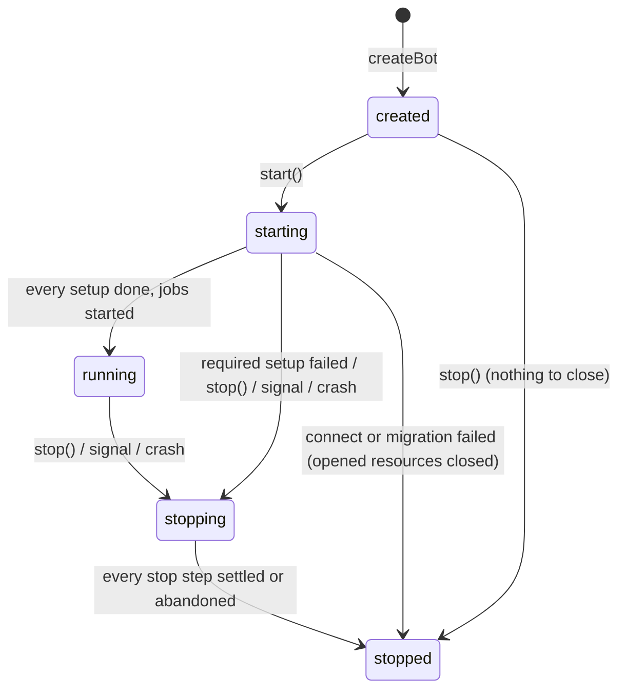

# Data Model: Bot Bootstrap and Lifecycle

The feature persists nothing: every entity below lives in memory for the life of one process.
Types are sketched in [contracts/public-api.md](./contracts/public-api.md); this file states
fields, rules and transitions.

## Bot

What `createBot` returns. One per process in production, several in tests.

| Field | Meaning |
|---|---|
| `state` | `created` → `starting` → `running` → `stopping` → `stopped` (see transitions) |
| `client` | the gateway client every listener is bound to |
| `translator`, `registry`, `settings`, `gate`, `logger` | the services built at creation |
| `start(token)` | runs the start steps; resolves when `running` |
| `stop(reason?)` | runs the stop steps; resolves with a `StopReport` |
| `deployCommands(target)` | sends every built command; no lifecycle effect |

Rules:

- Creation performs no I/O and fails synchronously on a duplicate module name, a duplicate
  catalog key or an invalid settings declaration (FR-003).
- Module names are unique; the error names both modules.

### State transitions

- `start()` outside `created` logs a warning and resolves without doing anything.
- `stop()` in `stopping` returns the same promise (FR-015); in `stopped` it resolves the last
  report.
- Interactions are served by the module routers only in `running`; in every other state the
  lifecycle dispatcher answers them (R5).

## Module (extends `BotModule`)

New optional fields on the existing contract:

| Field | Default | Meaning |
|---|---|---|
| `gated` | `true` | `false`: handlers are never gated, and no toggle is declared for it |
| `optional` | `false` | `true`: a failed `setup` disables only this module (FR-011a) |
| `build(context)` | none | returns the parts that need kernel services (R1) |

`build` returns a `ModuleParts`: `commands`, `contextMenuCommands`, `components`, `events`, `jobs`,
`setup`, `teardown`. `createBot` merges them with the same fields declared directly on the module
(both are routed; a module should use one style).

Rules:

- `build` is called once per bot, after every service exists and before any router registration.
- A `build` that throws fails `createBot` with an error naming the module.

## ModuleContext

What `build` receives: `logger` (child logger bound to `{ module: name }`), `translator`,
`settings` (the service), `registry`, `gate`, `presenter`, `clock`, `client`.

## Module runtime status

Kept by the bot, one per module:

| Status | Set when | Effect |
|---|---|---|
| `pending` | creation | handlers not reachable yet (the bot is not `running`) |
| `ready` | its `setup` resolved, or it has none | handlers served, jobs scheduled, `teardown` runs at stop |
| `unavailable` | optional module whose `setup` rejected | commands/components answer "unavailable", events skipped, jobs not scheduled, `teardown` skipped |

A required module whose `setup` rejects moves the bot to `stopping` instead.

## Lifecycle step

A named unit of the start or stop sequence, logged with its duration and outcome.

| Field | Meaning |
|---|---|
| `name` | `databases.connect`, `migrations.run`, `gateway.login`, `gateway.ready`, `module.setup`, `jobs.start`, `jobs.stop`, `module.teardown`, `databases.close`, `gateway.destroy`, `flush` |
| `module` / `target` | the module or database/flush name, when the step is per item |
| `outcome` | `ok`, `failed` (with error), `abandoned` (deadline reached, stop only) |

## StopReport

| Field | Meaning |
|---|---|
| `ok` | `true` when every step settled with `ok` |
| `reason` | `manual`, `signal` (with its name), `crash`, `startFailure` |
| `failed` | steps that rejected, with their error message |
| `abandoned` | steps still pending at the deadline |

Exit code when the kernel exits the process (signal, crash): `0` if `ok` and the reason is
`signal`, `1` otherwise.

## MigrationRunner (port)

| Operation | Meaning |
|---|---|
| `run()` | applies every pending migration in order; resolves `{ applied: string[] }` |

Rules (contract suite): a second `run()` applies nothing; a failing migration rejects and later
migrations are not applied; `applied` lists ids in application order.

In-memory twin: built from `{ id, up() }[]`, remembers applied ids in memory.

## Authorizer (existing port) in-memory twin

Grants kept in two maps (roles, users). Resolution through the existing `meetsResolvedLevel`.
Contract suite: grant/revoke per target kind, revoke reports whether a grant existed, a user grant
wins over role grants, the highest role level applies, `listGrants` reflects every change.

## Modal prompt result

`{ status: "submitted", interaction, values } | { status: "dismissed" }`. `values` is typed by the
modal's own `read`. `dismissed` covers timeout and a modal closed by the member.
