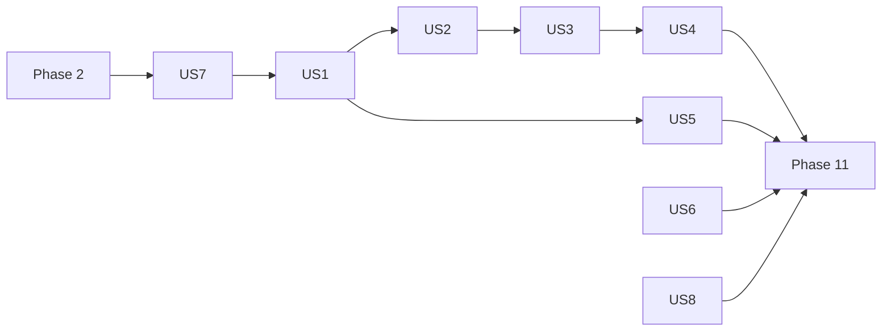

---

description: "Task list for Bot Bootstrap and Lifecycle"
---

# Tasks: Bot Bootstrap and Lifecycle

**Input**: Design documents from `/specs/002-bot-bootstrap/`

**Prerequisites**: plan.md, spec.md, research.md (R1 to R15), data-model.md, contracts/public-api.md,
quickstart.md

**Tests**: Required. Constitution VII (test-first): every implementation task is preceded by a
failing test task, and the test must fail for the right reason before the code exists.

**Organization**: grouped by user story, following the plan's five stacked pull requests:
PR 1 = Phase 2 + US7 + US8, PR 2 = US1 + US5, PR 3 = US2 + US3 + US4, PR 4 = US6, PR 5 = sandbox
and polish.

## Format: `[ID] [P?] [Story] Description`

- **[P]**: can run in parallel (different files, no dependency on an incomplete task)
- **[Story]**: user story from spec.md
- Paths are relative to the repository root. Tests mirror `packages/kernel/src/` under
  `packages/kernel/tests/`.
- Every new public file gets its own explicit entry in `packages/kernel/package.json` `exports`
  (no wildcard), in the same task that creates it; `tests/package-exports.test.ts` must stay green.
- Every port interface carries the JSDoc tag `@port`; every twin is plain code (no `vitest` import).
- Every task ends green on `pnpm typecheck && pnpm lint && pnpm knip && pnpm test`.

---

## Phase 1: Setup

- [X] T001 Create the branch `feat/002-port-twins` from `main` (after PR #40 merges) and check `.specify/feature.json` points at `specs/002-bot-bootstrap`

---

## Phase 2: Foundational (PR 1, blocks US7)

- [X] T002 Move `DescribeFn`, `ItFn`, `ExpectFn`, `ContractAssertion` from `packages/kernel/src/settings/testing/settings-store-contract.ts` to `packages/kernel/src/testing/contract-runner.ts`; import them from there in `settings-store-contract.ts` (no re-export from that file, AGENTS.md "No relay files"); make `packages/kernel/src/settings/testing/index.ts` export them `from "@/testing/contract-runner"`; add the `./testing/contract-runner` subpath. `tests/settings/in-memory/in-memory-settings-store.test.ts` stays green unchanged
- [X] T003 [P] Create `packages/kernel/tests/support/fake-client.ts`: `createFakeClient()` returning a real `discord.js` `Client({ intents: [] })` whose `login` and `destroy` are `vi.fn` spies (login resolves the token, never connects) and `emitReady(client)` emitting `clientReady`
- [X] T004 Tag every existing port interface with `@port` in its JSDoc: `Logger` (`src/logger.ts`), `Clock` (`src/clock.ts`), `DatabaseConnection` (`src/persistence/database.ts`), `Authorizer` (`src/authz/authorizer.ts`), `Scheduler` (`src/scheduler/scheduler.ts`), `ChannelExporter` (`src/discord/channel-exporter.ts`), `Presenter` (`src/discord/presenter.ts`), `LocaleResolver` (`src/discord/interaction/locale-resolver.ts`), `ModuleGate` (`src/settings/system/module-gate.ts`), `SettingsStore`, `GuildDirectory`, `SettingsChangedNotifier` (`src/settings/ports/*`)

**Checkpoint**: contract types shared, ports tagged.

---

## Phase 3: User Story 7 - Reference implementations for every port (Priority: P3, PR 1)

**Goal**: an exported in-memory twin for every port (research R15), contract suites for the
stateful ones, a default presenter, and the kernel's own test doubles rebuilt on the twins.

**Independent Test**: `tests/ports/every-port-has-a-twin.test.ts` fails until every `@port` has a
twin; contract suites pass; each twin's own test passes.

### Tests for User Story 7

- [X] T005 [US7] Write `packages/kernel/tests/ports/every-port-has-a-twin.test.ts`: scan `packages/kernel/src/**/*.ts` for interfaces whose JSDoc carries `@port`, and fail for each one missing from the test's `PORT_TWINS` table (port name → twin factory imported from its public subpath, `fixedClock` for `Clock`, `createDefaultPresenter` for `Presenter`, the existing `settings/in-memory` twins); start the table with the existing twins only, so it fails listing the missing ones
- [X] T006 [P] [US7] Write `runAuthorizerContract(name, factory, { describe, it, expect })` in `packages/kernel/src/authz/testing/authorizer-contract.ts`: grant/revoke role and user; `revokeRole`/`revokeUser` return `true` only when a grant existed; a direct user grant wins over role grants even when lower; the highest role level applies; `editor` meets `viewer`, not the reverse; `listGrants` reflects every change; export from `packages/kernel/src/authz/testing/index.ts`; subpath `./authz/testing`
- [X] T007 [P] [US7] Write `runMigrationRunnerContract(name, factory, { describe, it, expect })` in `packages/kernel/src/persistence/testing/migration-runner-contract.ts`, `factory(migrations)` returning a runner: applies in declaration order and reports `applied` ids "in application order"; "a second `run()` applies nothing"; "a failing migration rejects and later migrations are not applied", and a retry after fixing it applies only the remaining ones; export from `packages/kernel/src/persistence/testing/index.ts`; subpath `./persistence/testing`
- [X] T008 [P] [US7] Write `packages/kernel/tests/authz/in-memory-authorizer.test.ts` running `runAuthorizerContract` against `createInMemoryAuthorizer()`, plus a case seeded with `initial` grants; must fail
- [X] T009 [P] [US7] Write `packages/kernel/tests/persistence/in-memory-migration-runner.test.ts` running `runMigrationRunnerContract` against `createInMemoryMigrationRunner`; must fail
- [X] T010 [P] [US7] Write `packages/kernel/tests/discord/default-presenter.test.ts`: each of `confirmation`, `warning`, `error`, `denial`, `systemError` has the `CORE_MESSAGES` title in `en` and in `fr`, the matching `EMBED_COLORS` colour, the message as description; `systemError` carries the incident footer with the reference; must fail
- [X] T011 [P] [US7] Write `packages/kernel/tests/in-memory-logger.test.ts`: every level appends a `LogEntry` (`level`, `fields`, `message`) for both call forms (`(record, message)` and `(message)`); `child(bindings)` entries carry the bindings merged into `fields` and land in the parent's `entries`; must fail
- [X] T012 [P] [US7] Write `packages/kernel/tests/persistence/in-memory-database.test.ts`: `connect` is idempotent and counted, `close` counted and sets `connected` false, `failOnConnect(error)` makes the next `connect` reject with it; `driver` defaults to `"in-memory"`; must fail
- [X] T013 [P] [US7] Write `packages/kernel/tests/scheduler/in-memory-scheduler.test.ts`: `start(jobs)` records valid jobs and skips invalid ones with the same errors and logs as `CronScheduler` (reuse its cases: duplicate name, both/neither schedule, bad interval); `run(name)` runs the job now and isolates its error; `run` of an unknown name rejects; `runOnStart` jobs run once at `start`; `rescheduleCron` updates the job's `cron`; `stop` clears jobs and `started`; nothing runs by timer (fake timers advanced: zero runs); must fail
- [X] T014 [P] [US7] Write `packages/kernel/tests/discord/in-memory-channel-exporter.test.ts`: every `exportChannel` call is recorded with its arguments and resolves the configured outcome (default `{ destinationUsed: "discord", fellBackFromCloud: false }`); must fail
- [X] T015 [P] [US7] Write `packages/kernel/tests/discord/interaction/fixed-locale-resolver.test.ts` (resolves the given locale for any interaction) and `packages/kernel/tests/settings/system/in-memory-module-gate.test.ts` (seeded `disabled` map honoured; `disable`/`enable` per guild; other guilds unaffected); must fail

### Implementation for User Story 7

- [X] T016 [P] [US7] Implement `createInMemoryAuthorizer(initial?)` in `packages/kernel/src/authz/in-memory-authorizer.ts` (two maps, the existing `meetsResolvedLevel`, `listGrants` returns copies); subpath; T008 green
- [X] T017 [P] [US7] Define `Migration`, `MigrationReport`, `MigrationRunner` (`@port`) in `packages/kernel/src/persistence/migration-runner.ts`; implement `createInMemoryMigrationRunner(migrations)` in `packages/kernel/src/persistence/in-memory-migration-runner.ts` (applied ids in a `Set`, sequential `up()`, stops at the first rejection and rethrows it); subpaths; T009 green
- [X] T018 [P] [US7] Implement `createDefaultPresenter(translator)` in `packages/kernel/src/discord/default-presenter.ts`, same behaviour as `apps/sandbox-bot/src/shared/discord/embed-presenter.ts` (the sandbox file is deleted in T064); subpath; T010 green
- [X] T019 [P] [US7] Implement `createInMemoryLogger()` (`LogEntry`, `InMemoryLogger`) in `packages/kernel/src/in-memory-logger.ts`; subpath `./in-memory-logger`; T011 green
- [X] T020 [P] [US7] Implement `createInMemoryDatabase(driver?)` in `packages/kernel/src/persistence/in-memory-database.ts`; subpath; T012 green
- [X] T021 [US7] Extract `CronScheduler`'s job validation (`scheduleFailure` and the duplicate-name check) into `packages/kernel/src/scheduler/validate-jobs.ts` used by both schedulers (one definition), then implement `createInMemoryScheduler()` in `packages/kernel/src/scheduler/in-memory-scheduler.ts`; existing `tests/scheduler/scheduler.test.ts` stays green; subpath; T013 green
- [X] T022 [P] [US7] Implement `createInMemoryChannelExporter(outcome?)` in `packages/kernel/src/discord/in-memory-channel-exporter.ts`; subpath; T014 green
- [X] T023 [P] [US7] Implement `createFixedLocaleResolver(locale)` in `packages/kernel/src/discord/interaction/fixed-locale-resolver.ts` and `createInMemoryModuleGate(disabled?)` in `packages/kernel/src/settings/system/in-memory-module-gate.ts` (no `discord.js` import, the settings boundary test enforces it); subpaths; T015 green
- [X] T024 [US7] Fill `PORT_TWINS` in `tests/ports/every-port-has-a-twin.test.ts` with every twin from T016 to T023; T005 green
- [X] T025 [US7] Rebuild the kernel's test doubles on the twins, call sites unchanged: `tests/support/fake-logger.ts` returns `createInMemoryLogger()` with `vi.spyOn` on each level and `child` overridden to return the same double (today's behaviour, which suites rely on to see a child's calls on the parent spies); `tests/support/fake-locale-resolver.ts` returns `createFixedLocaleResolver` with `vi.spyOn(resolver, "resolve")`; `tests/support/fake-module-gate.ts` returns `createInMemoryModuleGate`. Every existing suite stays green with no assertion removed; update AGENTS.md "One definition per concept" rows (Logger, ModuleGate, LocaleResolver doubles) to point at the twins and the support wrappers

**Checkpoint**: every port has an exported twin; the coverage test guards new ports.

---

## Phase 4: User Story 8 - Keep the kernel within its constitution (Priority: P3, PR 1)

**Goal**: runtime dependencies and cron usage checked by tests (FR-027, FR-027a).

**Independent Test**: adding any other runtime dependency to the kernel makes the test fail.

- [X] T026 [P] [US8] Write `packages/kernel/tests/constitution/runtime-dependencies.test.ts`: read `packages/kernel/package.json`, fail on any `dependencies` key outside the test-local `ALLOWED_RUNTIME_DEPENDENCIES = ["node-cron", "zod"]` (comment: "Constitution Principle I, 2.1.0"); check the predicate rejects a copy of the manifest with an extra key
- [X] T027 [P] [US8] In `packages/kernel/tests/scheduler/scheduler.test.ts`, add a case with `vi.mock("node-cron")` asserting every `schedule` call receives a function (never a string path) and options without `distributed`, for a cron job, a timezone job and a reschedule
- [X] T028 [US8] Open PR 1 (`feat(kernel): ship an in-memory twin for every port`) with a `minor` changeset listing the new subpaths; README (`packages/kernel/README.md`): `authz/` row, Ports row, a "Testing with in-memory twins" section listing every twin

**Checkpoint**: PR 1 complete and green.

---

## Phase 5: User Story 1 - Start a bot from modules and adapters (Priority: P1, PR 2) 🎯 MVP

**Goal**: `createBot` assembles services and modules; modules receive services through `build`.

**Independent Test**: a bot created from two test modules and in-memory adapters routes a fake
command and a fake event in the guild's language, and skips a disabled module's handler.

### Tests for User Story 1

- [ ] T029 [P] [US1] Extend `packages/kernel/tests/module/module.test.ts` with type tests (`expectTypeOf`): `gated`, `optional`, `build(context): ModuleParts` are optional; `ModuleParts` has exactly `commands`, `contextMenuCommands`, `components`, `events`, `jobs`, `setup`, `teardown`; a module with none of the new fields still satisfies `BotModule`; `ModuleContext` has every `BotServices` member
- [ ] T030 [US1] Write `packages/kernel/tests/bot/create-bot.test.ts` (fake client, in-memory twins only): (a) catalogs, declarations, commands, components and events of every module are registered without the caller touching a router; (b) `build` receives finished services (`context.settings.get` works) and a logger whose entries carry `{ module }`; (c) two modules with the same name throw `DuplicateModuleError` naming both, before `client.login` is called; (d) a duplicate catalog key throws `ModuleRegistrationError` naming the second module, with the `DuplicateTranslationKeyError` as `cause`; (e) an invalid settings declaration gives `ModuleRegistrationError` with the `SettingsDeclarationError` as `cause`; (f) a `build` that throws gives `ModuleRegistrationError` with the module name; (g) `setup` declared on the module and returned by `build` gives `ModuleRegistrationError` with `part: "setup"` (same for `commands`); (h) with every module disabled on a guild, a `gated: false` module's command still runs and is absent from `registry.kernel` toggles; (i) a module with only `settings` and `translations` is in the registry and the toggles; (j) no presenter passed: a failing command replies with the default presenter in the guild's language; (k) a custom presenter and a custom `localeResolver` factory are used instead; (l) the bot exposes `translator`, `registry`, `settings`, `gate`, `presenter`, `clock`, `client`, `logger`; (m) every building block `createBot` uses is still importable from its own public subpath (FR-007); all must fail

### Implementation for User Story 1

- [ ] T031 [US1] Add `gated?`, `optional?`, `build?(context: ModuleContext): ModuleParts` and `ModuleParts` to `packages/kernel/src/module/module.ts`; define `BotServices` and `ModuleContext` in `packages/kernel/src/module/module-context.ts` (nothing under `module/` imports `bot/`); subpath `./module/module-context`; T029 green
- [ ] T032 [P] [US1] Create `DuplicateModuleError(first, second)` and `ModuleRegistrationError(moduleName, cause, part?)` in `packages/kernel/src/bot/bot-errors.ts`; subpath
- [ ] T033 [US1] Implement `packages/kernel/src/bot/assemble-modules.ts`: unique names; register each module's catalog into a `TranslationRegistry` seeded with `CORE_CATALOG` and `SETTINGS_CATALOG`, wrapping failures in `ModuleRegistrationError`; collect declarations (validated per module so the error names it); toggles only for `gated !== false`; then a second function calling `build(context)` once per module, failing when a part is declared both on the module and by `build`
- [ ] T034 [US1] Implement `createBot(options)` in `packages/kernel/src/bot/create-bot.ts` per `contracts/public-api.md`: translator (default locale `en`), `createSettingsRegistry`, `createSettingsService` (`guilds` default `createDiscordGuildDirectory(client)`, `notifier` default `createInProcessNotifier(logger)`, `clock` default `systemClock`), `createModuleGate`, presenter default `createDefaultPresenter`, locale resolver default `createGuildLocaleResolver`; build modules; register commands/components/events with the module name only when `gated !== false`; one `interactionCreate` listener through `InteractionRouter([commands, AutocompleteDispatcher, components])`; `start(token)` is a plain `client.login(token)` for now; client default `new Client({ intents: options.discord?.intents ?? [GatewayIntentBits.Guilds] })`; subpath `./bot/create-bot`; T030 green

**Checkpoint**: MVP: a bot is assembled from modules with no wiring code.

---

## Phase 6: User Story 5 - Deploy commands without starting the bot (Priority: P2, PR 2)

**Goal**: `bot.deployCommands` sends every command with no lifecycle effect.

**Independent Test**: the in-memory deploy transport records one request per target; no login.

- [ ] T035 [P] [US5] Write `packages/kernel/tests/discord/command/in-memory-deploy-rest.test.ts` (records `route` and `body` of each `put`, resolves) and failing cases in `packages/kernel/tests/discord/command/router.test.ts` for `deployCommands(token, clientId, rest)`: one `put` for the global scope (even when empty) and one per guild, no `REST` created when `rest` is given
- [ ] T036 [P] [US5] Write `packages/kernel/tests/bot/deploy-commands.test.ts`: `bot.deployCommands({ token, clientId, rest })` returns the count, sends the commands of every module (built ones included), and `client.login`, database `connect`, migrations and module `setup` are never called
- [ ] T037 [US5] Define `CommandDeployRest` (`@port`) in `packages/kernel/src/discord/command/command-deploy-rest.ts`, implement `createInMemoryDeployRest()` in `packages/kernel/src/discord/command/in-memory-deploy-rest.ts`, add the optional `rest` parameter to `CommandRouter.deployCommands` (`packages/kernel/src/discord/command/router.ts`), add the twin to `PORT_TWINS`; subpaths; T035 green
- [ ] T038 [US5] Add `deployCommands(target)` to the bot in `packages/kernel/src/bot/create-bot.ts`, delegating to the command router; T036 green
- [ ] T039 [US5] Write `packages/kernel/tests/bot/minimal-bot.test.ts` proving SC-007: one module, in-memory twins only, start, serve one command, stop, in under 30 lines (no hand-written double); it doubles as the README example
- [ ] T040 [US5] Open PR 2 (`feat(bot): create a bot from modules`) stacked on PR 1, with a `minor` changeset; README: "Starting a bot" section (createBot, `build(context)`, `gated`, deploy, the minimal example of T039, SC-002) and the `bot/` row in "What is in it"

**Checkpoint**: PR 2 complete: create and deploy work.

---

## Phase 7: User Story 2 - Run module setup, migrations and jobs at start (Priority: P1, PR 3)

**Goal**: ordered start with optional modules (FR-008 to FR-011a).

**Independent Test**: fake client and in-memory twins; the recorded call order is connect,
migrate, login, ready, setup (module order), jobs.

### Tests for User Story 2

- [ ] T041 [P] [US2] Write `packages/kernel/tests/bot/lifecycle-step.test.ts` for `runStep(name, action, { logger, deadline?, target? })`: logs name and duration on success, logs step and target on failure and rethrows, with a deadline resolves `{ outcome: "abandoned" }` when the action is still pending (fake timers)
- [ ] T042 [P] [US2] Write `packages/kernel/tests/bot/in-memory-process.test.ts` (`on`/`off` tracked per event, `emit` calls the listeners, `listenerCount`, `exit` records the code in `exits` and does not exit) and `packages/kernel/tests/discord/in-memory-module-availability.test.ts` (`markUnavailable`, seeded list, `isAvailable`); must fail
- [ ] T043 [US2] Write `packages/kernel/tests/bot/bot-start.test.ts` with `createInMemoryDatabase`, `createInMemoryMigrationRunner`, `createInMemoryScheduler`: (a) order `databases.connect` (each, in order) → `migrations.run` → `login` → `clientReady` → `setup` per module in module order → `scheduler.start` with every ready module's jobs → `state === "running"`; (b) a `runOnStart` job ran once; (c) a database connect (`failOnConnect`) or migration failure: `start` rejects with the original error, `login` never called, connected databases closed, `state === "stopped"`; (d) a required module's `setup` rejects: `start` rejects with that error after the stop steps ran; (e) an optional module's `setup` rejects: start completes, its command answers the `moduleUnavailable` denial, its event handler is not called, its jobs are not in `scheduler.jobs`, its `teardown` is not called at stop; (f) a second `start()` logs a warning and does nothing; all must fail

### Implementation for User Story 2

- [ ] T044 [P] [US2] Add `moduleUnavailable: "core.lifecycle.module-unavailable"` and `botRestarting: "core.lifecycle.restarting"` to `CORE_MESSAGES` and `CORE_CATALOG` in `packages/kernel/src/discord/i18n.ts` (en "This feature is unavailable right now." / fr "Cette fonctionnalité est indisponible pour le moment."; en "The bot is restarting. Try again in a moment." / fr "Le bot redémarre. Réessayez dans un instant.")
- [ ] T045 [US2] Define `ProcessLike` and `ProcessEvent` (`@port`, `exit` returns `void`) in `packages/kernel/src/bot/process-like.ts`, `StopReport`/`StopReason` in `packages/kernel/src/bot/stop-report.ts`, `ModuleAvailability` (`@port`) in `packages/kernel/src/discord/module-availability.ts`; implement `createInMemoryProcess()` in `packages/kernel/src/bot/in-memory-process.ts` and `createInMemoryModuleAvailability()` in `packages/kernel/src/discord/in-memory-module-availability.ts`; add both to `PORT_TWINS`; subpaths; T042 green
- [ ] T046 [US2] Write failing router cases, then add the optional `availability?: ModuleAvailability` dependency to `CommandRouter` (`packages/kernel/src/discord/command/router.ts`), `ComponentRouter` (`packages/kernel/src/discord/components/component-router.ts`) and `EventRouter` (`packages/kernel/src/discord/events/event-router.ts`), checked before the guild gate: commands and components answer `moduleUnavailableEmbed` (new `packages/kernel/src/discord/settings/module-unavailable-embed.ts`, mirroring `module-disabled-embed.ts`), events are skipped with a debug log; tests in `tests/discord/command/router.test.ts`, `tests/discord/components/component-router.test.ts`, `tests/discord/events/event-router.test.ts`, using `createInMemoryModuleAvailability`
- [ ] T047 [US2] Implement `runStep` in `packages/kernel/src/bot/lifecycle-step.ts`; T041 green
- [ ] T048 [US2] Implement the module status set (`pending`, `ready`, `unavailable`) implementing `ModuleAvailability` in `packages/kernel/src/bot/module-status.ts`
- [ ] T049 [US2] Implement the start sequence in `packages/kernel/src/bot/lifecycle.ts` (states per data-model.md: `created → starting → running`, failure paths to `stopping`/`stopped`) and wire it into `createBot` (`start(token)` replaces the plain login; `adapters.scheduler` default `new CronScheduler(logger)`); T043 green

**Checkpoint**: start is ordered and optional modules degrade alone.

---

## Phase 8: User Story 3 - Shut down gracefully (Priority: P1, PR 3)

**Goal**: ordered, bounded, idempotent stop; "restarting" reply while not running (FR-009, FR-012
to FR-015).

**Independent Test**: stop a started bot and assert the call order; a hanging teardown is abandoned
at the deadline while the gateway close and flushes still run.

### Tests for User Story 3

- [ ] T050 [P] [US3] Write `packages/kernel/tests/bot/lifecycle-dispatcher.test.ts`: while the state is not `running`, a chat input, context menu, button and modal interaction each get an ephemeral `botRestarting` denial in the resolved locale, and an autocomplete gets `respond([])`; in `running` it returns `false` and replies nothing
- [ ] T051 [US3] Write `packages/kernel/tests/bot/bot-stop.test.ts` (fake timers, in-memory twins): (a) order `scheduler.stop` → `teardown` in reverse module order (only modules whose `setup` succeeded) → databases `close` in reverse order → `client.destroy` → flushes in order, each once, report `{ ok: true, reason: "manual" }`; (b) a rejecting teardown is logged with the module name, later steps still run, report lists it in `failed`; (c) a never-resolving teardown with `shutdownTimeoutMs: 100`: logged as abandoned, `client.destroy` and flushes still run within the 1 000 ms grace, report `ok: false` with it in `abandoned`, and `exit` is never called (programmatic stop); (d) two concurrent `stop()` calls return the same promise and steps run once; (e) `stop()` on a `created` bot resolves with nothing to close; (f) an interaction during `stopping` gets the restarting reply; (g) a flush failure is written to `process.stderr` (spied); all must fail

### Implementation for User Story 3

- [ ] T052 [US3] Implement the lifecycle dispatcher in `packages/kernel/src/bot/lifecycle-dispatcher.ts` (uses `replyLocale` and `sendEmbed`), placed first in the bot's `InteractionRouter`; T050 green
- [ ] T053 [US3] Implement the stop sequence in `packages/kernel/src/bot/lifecycle.ts`: one deadline from `shutdownTimeoutMs` (default 10 000), each step raced with `runStep`, a fixed 1 000 ms grace for the steps after an abandoned one, shared promise, `StopReport`, `stop()` takes no argument; flush failures go to `process.stderr`; T051 green

**Checkpoint**: stop is ordered, bounded and idempotent.

---

## Phase 9: User Story 4 - Survive and report crashes (Priority: P2, PR 3)

**Goal**: signal and crash handlers, installed on start and removed on stop (FR-014, FR-016 to
FR-018).

**Independent Test**: with the in-memory process, a crash is logged once as fatal, the stop runs
and the exit code is 1; no listener remains after stop.

- [ ] T054 [US4] Write `packages/kernel/tests/bot/process-handlers.test.ts` with `createInMemoryProcess`: (a) `SIGTERM` runs the stop with reason `signal`, then `exits` is `[0]`; (b) a signal stop that abandons a step exits with 1; (c) `unhandledRejection` and `uncaughtException` are logged once at `fatal` with the stack, stop runs with reason `crash`, `exits` is `[1]`; (d) a second signal during the stop runs nothing twice; (e) `handleSignals: false` and `handleCrashes: false` install no listener; (f) after `stop()`, `listenerCount` is 0 for all four events; (g) a programmatic `bot.stop()` leaves `exits` empty even when a step is abandoned; all must fail
- [ ] T055 [US4] Implement `installProcessHandlers` in `packages/kernel/src/bot/process-handlers.ts` (returns a remover; default `globalThis.process`), called by `start` and removed at the end of the stop; exit only for `signal`/`crash` reasons (research R7, FR-014); T054 green
- [ ] T056 [US4] Open PR 3 (`feat(bot): start and stop in order`) stacked on PR 2, with a `minor` changeset; README: "Lifecycle" subsection (start order, stop order, timeout, signals, crashes, `optional` modules, the two new catalog keys)

**Checkpoint**: PR 3 complete: the full lifecycle works.

---

## Phase 10: User Story 6 - Ask a member for input in a modal (Priority: P2, PR 4)

**Goal**: one shared, typed modal prompt (FR-021 to FR-023).

**Independent Test**: only the right member's submission for this opening is returned;
`dismissed` on timeout.

- [ ] T057 [US6] Write `packages/kernel/tests/discord/interaction/prompt-modal.test.ts` with a fake interaction (`showModal`, `awaitModalSubmit` honouring `filter` and `time`, `replied`, `deferred`): (a) `submitted` with typed values from a `createModal` modal and the submission interaction; (b) the filter rejects another member and another opening's custom id (two openings with distinct states); (c) timeout (the only signal Discord gives, also for a closed modal) → `{ status: "dismissed" }` and nothing logged; (d) a replied or deferred interaction throws `ModalPromptError` before `showModal`; (e) `timeoutMs` overrides `MODAL_PROMPT_TIMEOUT_MS` (5 minutes); must fail
- [ ] T058 [US6] Implement `promptModal`, `PromptableModal`, `ModalPromptResult`, `MODAL_PROMPT_TIMEOUT_MS` in `packages/kernel/src/discord/interaction/prompt-modal.ts` and `ModalPromptError` in `packages/kernel/src/discord/interaction/prompt-modal-errors.ts`; move `nextModalOpenState` there from `settings-editor-field-modal.ts`; subpaths; T057 green
- [ ] T059 [US6] Replace `collectModalSubmission` in `packages/kernel/src/discord/components/settings-editor/settings-editor-field-modal.ts` with `promptModal` (keeping the `isFromMessage` check and the `null` result on anything but a message submission); `tests/discord/components/settings-editor/settings-editor-field-modal.test.ts` and the other suites of that folder stay green without edits
- [ ] T060 [US6] Open PR 4 (`feat(discord): prompt a modal and await its answer`) stacked on PR 3, with a `minor` changeset; README: `promptModal` in the `discord/interaction/` row and a short example

**Checkpoint**: PR 4 complete.

---

## Phase 11: Sandbox and polish (PR 5, FR-028, SC-001)

- [ ] T061 [P] Rewrite the demo module to `build(context)` in `apps/sandbox-bot/src/modules/demo/demo.module.ts`; replace `settings: () => SettingsService` by `settings: SettingsService` in its command deps and every `settings()` call site under `apps/sandbox-bot/src/modules/demo/`
- [ ] T062 [P] Rewrite the admin module to `build(context)` with `gated: false` in `apps/sandbox-bot/src/modules/admin/admin.module.ts`; same accessor removal under `apps/sandbox-bot/src/modules/admin/` (`kernelSettings` accessor becomes `context.registry.kernel`)
- [ ] T063 [P] Rewrite the basics module to `build(context)` in `apps/sandbox-bot/src/modules/basics/basics.module.ts`
- [ ] T064 Replace `apps/sandbox-bot/src/bootstrap/create-sandbox.ts` with one `createBot` call (modules, pino logger, `createSettingsStore(config.settingsStore)`, paginator catalog through a module's `translations`, pino flush in `lifecycle.flushes`), under 40 lines (SC-001); delete `apps/sandbox-bot/src/shared/discord/embed-presenter.ts`
- [ ] T065 Rewrite `apps/sandbox-bot/src/main.ts` to `await bot.start(config.token)` (no hand-written signal handling) and `apps/sandbox-bot/src/register.ts` to `bot.deployCommands({ token, clientId })`; run `pnpm knip` to confirm nothing is left unused
- [ ] T066 Update `apps/sandbox-bot/README.md` ("Project layout": `bootstrap/` holds only the `createBot` call; modules use `build(context)`)
- [ ] T067 Run `quickstart.md` §1 (full gate) and §3 (sandbox by hand: register, start, `/config`, `/server` with every module off, Ctrl+C order and exit code 0, "restarting" reply at start); record the results in the PR description
- [ ] T068 Update `docs/roadmap.md` spec 2 status to "Specified and delivered", check that PRs 1 to 4 each carry their changeset (no new one), and open PR 5 (`refactor(sandbox): boot the sandbox with createBot`) stacked on PR 4

---

## Dependencies & Execution Order

### Phase dependencies

- Phase 2 → US7 (T006, T007 need T002; T005 needs T004).
- US7 and US8 are independent of each other (PR 1).
- US1 needs PR 1 (default presenter T018, twins). US5 needs US1 (the bot).
- US2 needs US1. US3 needs US2 (a started bot). US4 needs US3 (the stop it triggers).
- US6 is independent of US1 to US5 (only the settings editor); stacked after PR 3 for review order,
  but can be developed in parallel from `main`.
- Phase 11 needs every earlier phase.

### Story graph

### Within each story

Tests first and failing, then types, then implementation, then the PR task.

## Parallel Opportunities

- Phase 2: T003 in parallel with T002 and T004.
- US7: T006 to T015 in parallel (T005 after T004); then T016 to T020, T022, T023 in parallel; T021
  alone (touches `scheduler.ts`); T024 and T025 last.
- US8: T026 and T027 in parallel, and in parallel with all of US7 (T027 after T021).
- US1: T029 in parallel with T032.
- US5: T035 and T036 in parallel.
- US2: T041, T042, T044 in parallel.
- US6: the whole phase in parallel with US2 to US4 (different files).
- Phase 11: T061, T062, T063 in parallel.

## Implementation Strategy

### MVP first

1. PR 1 (Phase 2, US7, US8): twins for every port, no behaviour change for existing users.
2. PR 2 (US1, US5): **stop and validate**: a bot is created from modules and can deploy. This is
   the MVP; the sandbox could already use it with `start` = login.
3. PR 3 (US2, US3, US4): the lifecycle.
4. PR 4 (US6), in parallel if convenient.
5. PR 5: the sandbox proves no wiring is missing; release 1.1.0.

### Totals

68 tasks: Setup 1, Foundational 3, US7 21, US8 3, US1 6, US5 6, US2 9, US3 4, US4 3, US6 4,
Sandbox and polish 8.
