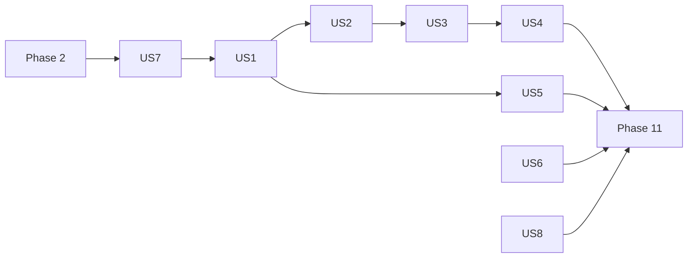

---

description: "Task list for Bot Bootstrap and Lifecycle"
---

# Tasks: Bot Bootstrap and Lifecycle

**Input**: Design documents from `/specs/002-bot-bootstrap/`

**Prerequisites**: plan.md, spec.md, research.md (R1 to R14), data-model.md, contracts/public-api.md,
quickstart.md

**Tests**: Required. Constitution VII (test-first): every implementation task is preceded by a
failing test task, and the test must fail for the right reason before the code exists.

**Organization**: grouped by user story, following the plan's five stacked pull requests:
PR 1 = Phase 2 + US7 + US8, PR 2 = US1 + US5, PR 3 = US2 + US3 + US4, PR 4 = US6, PR 5 = sandbox
and polish.

## Format: `[ID] [P?] [Story] Description`

- **[P]**: can run in parallel (different files, no dependency on an incomplete task)
- **[Story]**: user story from spec.md
- Paths are relative to the repository root. Tests mirror `packages/kernel/src/` under
  `packages/kernel/tests/`.
- Every new public file gets its own explicit entry in `packages/kernel/package.json` `exports`
  (no wildcard), in the same task that creates it; `tests/package-exports.test.ts` must stay green.
- Every task ends green on `pnpm typecheck && pnpm lint && pnpm knip && pnpm test`.

---

## Phase 1: Setup

- [ ] T001 Create the branch `feat/002-reference-twins` from `main` (after PR #40 merges) and point `.specify/feature.json` at `specs/002-bot-bootstrap` (already done on the spec branch; verify only)

---

## Phase 2: Foundational (PR 1, blocks the contract suites of US7)

- [ ] T002 Move `DescribeFn`, `ItFn`, `ExpectFn`, `ContractAssertion` from `packages/kernel/src/settings/testing/settings-store-contract.ts` to `packages/kernel/src/testing/contract-runner.ts`; import them from there in `settings-store-contract.ts` (no re-export from that file, AGENTS.md "No relay files"); make `packages/kernel/src/settings/testing/index.ts` export them `from "@/testing/contract-runner"`; add the `./testing/contract-runner` subpath. `tests/settings/in-memory/in-memory-settings-store.test.ts` stays green unchanged
- [ ] T003 [P] Create `packages/kernel/tests/support/fake-process.ts`: `createFakeProcess()` returning a `ProcessLike`-shaped object that records `on`/`off` listeners per event, exposes `emit(event, ...args)`, `listenerCount(event)`, a writable `exitCode`, and an `exit` spy that records the code and does not exit (type-only until T030 defines `ProcessLike`: declare it structurally here, then switch the import in T030)
- [ ] T004 [P] Create `packages/kernel/tests/support/fake-client.ts`: `createFakeClient()` returning a real `discord.js` `Client({ intents: [] })` whose `login` and `destroy` are `vi.fn` spies (login resolves the token, never connects) and a helper `emitReady(client)` that emits `clientReady`

**Checkpoint**: contract types shared, test doubles ready.

---

## Phase 3: User Story 7 - Reference implementations for every port (Priority: P3, PR 1)

**Goal**: in-memory authorizer and migration runner with contract suites; default presenter.

**Independent Test**: the authorizer and migration runner contract suites pass against the
in-memory twins; the presenter renders every outcome in en and fr.

### Tests for User Story 7

- [ ] T005 [P] [US7] Write `runAuthorizerContract(name, factory, { describe, it, expect })` in `packages/kernel/src/authz/testing/authorizer-contract.ts` (no `vitest` import): grant/revoke role and user; `revokeRole`/`revokeUser` return `true` only when a grant existed; a direct user grant wins over role grants even when lower; the highest role level applies; `editor` meets `viewer`, not the reverse; `listGrants` reflects every change; export it from `packages/kernel/src/authz/testing/index.ts` with the contract-runner types; subpath `./authz/testing`
- [ ] T006 [P] [US7] Write `runMigrationRunnerContract(name, factory, { describe, it, expect })` in `packages/kernel/src/persistence/testing/migration-runner-contract.ts`, where `factory(migrations)` returns a runner: applies in declaration order and reports `applied` ids "in application order"; "a second `run()` applies nothing"; "a failing migration rejects and later migrations are not applied", and a retry after fixing it applies only the remaining ones; export from `packages/kernel/src/persistence/testing/index.ts`; subpath `./persistence/testing`
- [ ] T007 [P] [US7] Write `packages/kernel/tests/authz/in-memory-authorizer.test.ts` running `runAuthorizerContract` against `createInMemoryAuthorizer()`, plus one case seeding it with `initial` grants; it must fail (module missing)
- [ ] T008 [P] [US7] Write `packages/kernel/tests/persistence/in-memory-migration-runner.test.ts` running `runMigrationRunnerContract` against `createInMemoryMigrationRunner`; it must fail
- [ ] T009 [P] [US7] Write `packages/kernel/tests/discord/default-presenter.test.ts`: each of `confirmation`, `warning`, `error`, `denial`, `systemError` has the `CORE_MESSAGES` title in `en` and in `fr`, the matching `EMBED_COLORS` colour, the message as description; `systemError` carries the incident footer with the reference; it must fail

### Implementation for User Story 7

- [ ] T010 [P] [US7] Implement `createInMemoryAuthorizer(initial?: PermissionGrants): Authorizer` in `packages/kernel/src/authz/in-memory-authorizer.ts` (two maps, resolution through the existing `meetsResolvedLevel`, `listGrants` returns copies); subpath `./authz/in-memory-authorizer`; T007 green
- [ ] T011 [P] [US7] Define `Migration`, `MigrationReport`, `MigrationRunner` in `packages/kernel/src/persistence/migration-runner.ts` and implement `createInMemoryMigrationRunner(migrations)` in `packages/kernel/src/persistence/in-memory-migration-runner.ts` (applied ids kept in a `Set`, sequential `up()`, stops at the first rejection and rethrows it); subpaths `./persistence/migration-runner`, `./persistence/in-memory-migration-runner`; T008 green
- [ ] T012 [P] [US7] Implement `createDefaultPresenter(translator)` in `packages/kernel/src/discord/default-presenter.ts`, same behaviour as `apps/sandbox-bot/src/shared/discord/embed-presenter.ts` (do not delete the sandbox file yet, T051 does); subpath `./discord/default-presenter`; T009 green

**Checkpoint**: every port has an in-memory twin; `Presenter` has a default.

---

## Phase 4: User Story 8 - Keep the kernel within its constitution (Priority: P3, PR 1)

**Goal**: runtime dependencies and cron usage checked by tests (FR-027, FR-027a).

**Independent Test**: adding any other runtime dependency to the kernel makes the test fail.

- [ ] T013 [P] [US8] Write `packages/kernel/tests/constitution/runtime-dependencies.test.ts`: read `packages/kernel/package.json`, fail on any `dependencies` key outside the test-local `ALLOWED_RUNTIME_DEPENDENCIES = ["node-cron", "zod"]` (comment: "Constitution Principle I, 2.1.0"); verify it fails when a fake key is added to a copy of the manifest object
- [ ] T014 [P] [US8] In `packages/kernel/tests/scheduler/scheduler.test.ts`, add a case with `vi.mock("node-cron")` asserting every `schedule` call receives a function (never a string path) and options without `distributed`, for a cron job, a timezone job and a reschedule
- [ ] T015 [US8] Open PR 1 (`feat(kernel): ship in-memory twins, a default presenter and constitution checks`) with a `minor` changeset for `@azurioh/discord-kernel` listing the new subpaths; update the `authz/`, Ports and "Making it yours" parts of `packages/kernel/README.md`

**Checkpoint**: PR 1 complete and green.

---

## Phase 5: User Story 1 - Start a bot from modules and adapters (Priority: P1, PR 2) 🎯 MVP

**Goal**: `createBot` assembles services and modules; modules receive services through `build`.

**Independent Test**: a bot created from two test modules and in-memory adapters routes a fake
command and a fake event in the guild's language, and skips a disabled module's handler.

### Tests for User Story 1

- [ ] T016 [P] [US1] Extend `packages/kernel/tests/module/module.test.ts` with type tests (`expectTypeOf`): `gated`, `optional`, `build(context): ModuleParts` are optional; `ModuleParts` has exactly `commands`, `contextMenuCommands`, `components`, `events`, `jobs`, `setup`, `teardown`; a module with none of the new fields still satisfies `BotModule`
- [ ] T017 [US1] Write `packages/kernel/tests/bot/create-bot.test.ts` (fake client, `createInMemorySettingsStore`, `createFakeLogger`): (a) catalogs, declarations, commands, components and events of every module are registered without the caller touching a router; (b) `build` receives finished services (`context.settings.get` works) and a logger bound to `{ module }`; (c) two modules with the same name throw `DuplicateModuleError` naming both, before `client.login` is ever called; (d) a duplicate catalog key throws `DuplicateTranslationKeyError`; (e) a `build` that throws gives `ModuleBuildError` with the module name; (f) with every module disabled on a guild, a `gated: false` module's command still runs and is absent from `registry.kernel` toggles; (g) no presenter passed: a failing command replies with the default presenter in the guild's language; (h) a custom presenter and a custom `localeResolver` factory are used instead; (i) the bot exposes `translator`, `registry`, `settings`, `gate`, `presenter`, `clock`, `client`, `logger`; all must fail (module missing)

### Implementation for User Story 1

- [ ] T018 [US1] Add `gated?`, `optional?`, `build?(context: ModuleContext): ModuleParts` and the `ModuleParts` interface to `packages/kernel/src/module/module.ts`; create `ModuleContext` (= `BotServices` with a module-bound `logger`) in `packages/kernel/src/module/module-context.ts` and `BotServices` in `packages/kernel/src/bot/bot-services.ts` (one definition, imported by both); subpaths `./module/module-context`, `./bot/bot-services`; T016 green
- [ ] T019 [P] [US1] Create `DuplicateModuleError(first, second)` and `ModuleBuildError(moduleName, cause)` in `packages/kernel/src/bot/bot-errors.ts`; subpath `./bot/bot-errors`
- [ ] T020 [US1] Implement `assembleModules` in `packages/kernel/src/bot/assemble-modules.ts`: check unique names; register every catalog into a `TranslationRegistry` seeded with `CORE_CATALOG` and `SETTINGS_CATALOG`; collect declarations; toggles only for modules with `gated !== false`; return the static inputs for the registry, then a second function that calls `build(context)` once per module and merges its parts with the parts declared directly on the module
- [ ] T021 [US1] Implement `createBot(options)` in `packages/kernel/src/bot/create-bot.ts` per `contracts/public-api.md`: translator (default locale `en`), `createSettingsRegistry`, `createSettingsService` (store, `guilds` default `createDiscordGuildDirectory(client)`, `notifier` default `createInProcessNotifier(logger)`, `clock` default `systemClock`), `createModuleGate`, presenter default `createDefaultPresenter`, locale resolver default `createGuildLocaleResolver`; build modules; register commands/components/events with the module name only when `gated !== false`; one `interactionCreate` listener through `InteractionRouter([commands, AutocompleteDispatcher, components])`; `start(token)` is a plain `client.login(token)` for now (lifecycle in US2); client default `new Client({ intents: options.discord?.intents ?? [GatewayIntentBits.Guilds] })`; subpath `./bot/create-bot`; T017 green

**Checkpoint**: MVP: a bot is assembled from modules with no wiring code.

---

## Phase 6: User Story 5 - Deploy commands without starting the bot (Priority: P2, PR 2)

**Goal**: `bot.deployCommands` sends every command with no lifecycle effect.

**Independent Test**: a fake REST records one request per target; no login happens.

- [ ] T022 [P] [US5] Write failing cases in `packages/kernel/tests/discord/command/router.test.ts` for `deployCommands(token, clientId, rest)`: a recording `rest` receives one `put` for the global scope (even when empty) and one per guild, and no `REST` instance is created when `rest` is given
- [ ] T023 [P] [US5] Write `packages/kernel/tests/bot/deploy-commands.test.ts`: `bot.deployCommands({ token, clientId, rest })` returns the count, sends the commands of every module (built ones included), and `client.login`, database `connect`, migrations and module `setup` are never called
- [ ] T024 [US5] Add the optional `rest?: CommandDeployRest` parameter to `CommandRouter.deployCommands` in `packages/kernel/src/discord/command/router.ts` (type `CommandDeployRest` in `packages/kernel/src/discord/command/command-deploy-rest.ts`, subpath added); T022 green
- [ ] T025 [US5] Add `deployCommands(target)` to the bot in `packages/kernel/src/bot/create-bot.ts`, delegating to the command router; T023 green
- [ ] T026 [US5] Open PR 2 (`feat(bot): create a bot from modules`) stacked on PR 1, with a `minor` changeset; add a "Starting a bot" section to `packages/kernel/README.md` (createBot, `build(context)`, `gated`, deploy) and the `bot/` row to "What is in it"

**Checkpoint**: PR 2 complete: create and deploy work.

---

## Phase 7: User Story 2 - Run module setup, migrations and jobs at start (Priority: P1, PR 3)

**Goal**: ordered start with optional modules (FR-008 to FR-011a).

**Independent Test**: fake client and in-memory adapters; the recorded call order is connect,
migrate, login, ready, setup (module order), jobs.

### Tests for User Story 2

- [ ] T027 [P] [US2] Write `packages/kernel/tests/bot/lifecycle-step.test.ts` for `runStep(name, action, { logger, deadline?, target? })`: logs the step name and duration on success, logs step and target on failure and rethrows, and with a deadline resolves `{ outcome: "abandoned" }` when the action is still pending (fake timers)
- [ ] T028 [US2] Write `packages/kernel/tests/bot/bot-start.test.ts`: (a) order `databases.connect` (each, in order) → `migrations.run` → `login` → `clientReady` → `setup` of each module in module order → `scheduler.start` with every ready module's jobs → `state === "running"`; (b) a job with `runOnStart` runs once; (c) a database connect or migration failure: `start` rejects with the original error, `login` never called, already-connected databases closed, `state === "stopped"`; (d) a required module's `setup` rejects: `start` rejects with that error after the stop steps ran; (e) an optional module's `setup` rejects: start completes, its command answers the `moduleUnavailable` denial, its event handler is not called, its jobs are not scheduled, its `teardown` is not called at stop; (f) a second `start()` logs a warning and does nothing; all must fail

### Implementation for User Story 2

- [ ] T029 [P] [US2] Add `moduleUnavailable: "core.lifecycle.module-unavailable"` and `botRestarting: "core.lifecycle.restarting"` to `CORE_MESSAGES` and their entries to `CORE_CATALOG` in `packages/kernel/src/discord/i18n.ts` (en "This feature is unavailable right now." / fr "Cette fonctionnalité est indisponible pour le moment."; en "The bot is restarting. Try again in a moment." / fr "Le bot redémarre. Réessayez dans un instant.")
- [ ] T030 [P] [US2] Define `ProcessLike` in `packages/kernel/src/bot/process-like.ts`, `StopReport`/`StopReason` in `packages/kernel/src/bot/stop-report.ts`, `ModuleAvailability` in `packages/kernel/src/discord/module-availability.ts` per the contract; subpaths added; switch `tests/support/fake-process.ts` to `import type { ProcessLike }`
- [ ] T031 [US2] Write failing router cases, then add the optional `availability?: ModuleAvailability` dependency to `CommandRouter` (`packages/kernel/src/discord/command/router.ts`), `ComponentRouter` (`packages/kernel/src/discord/components/component-router.ts`) and `EventRouter` (`packages/kernel/src/discord/events/event-router.ts`), checked before the guild gate: commands and components answer `moduleUnavailableEmbed` (new `packages/kernel/src/discord/settings/module-unavailable-embed.ts`, mirroring `module-disabled-embed.ts`), events are skipped with a debug log; tests in `tests/discord/command/router.test.ts`, `tests/discord/components/component-router.test.ts`, `tests/discord/events/event-router.test.ts`
- [ ] T032 [US2] Implement `runStep` in `packages/kernel/src/bot/lifecycle-step.ts`; T027 green
- [ ] T033 [US2] Implement the module status set (`pending`, `ready`, `unavailable`) implementing `ModuleAvailability` in `packages/kernel/src/bot/module-status.ts`
- [ ] T034 [US2] Implement the start sequence in `packages/kernel/src/bot/lifecycle.ts` (state machine per data-model.md: `created → starting → running`, failure paths to `stopping`/`stopped`) and wire it into `createBot` (`start(token)` replaces the plain login; `adapters.scheduler` default `new CronScheduler(logger)`); T028 green

**Checkpoint**: start is ordered and optional modules degrade alone.

---

## Phase 8: User Story 3 - Shut down gracefully (Priority: P1, PR 3)

**Goal**: ordered, bounded, idempotent stop; "restarting" reply while not running (FR-009, FR-012
to FR-015).

**Independent Test**: stop a started bot and assert the call order; a hanging teardown is abandoned
at the deadline while the gateway close and flushes still run.

### Tests for User Story 3

- [ ] T035 [P] [US3] Write `packages/kernel/tests/bot/lifecycle-dispatcher.test.ts`: while the state is not `running`, a chat input, context menu, button and modal interaction each get an ephemeral `botRestarting` denial in the resolved locale, and an autocomplete gets `respond([])`; in `running` it returns `false` and replies nothing
- [ ] T036 [US3] Write `packages/kernel/tests/bot/bot-stop.test.ts` (fake timers): (a) order `scheduler.stop` → `teardown` in reverse module order (only modules whose `setup` succeeded) → databases `close` in reverse order → `client.destroy` → flushes in order, each once, report `{ ok: true, reason: "manual" }`; (b) a rejecting teardown is logged with the module name, later steps still run, report lists it in `failed`; (c) a never-resolving teardown with `shutdownTimeoutMs: 100`: logged as abandoned, `client.destroy` and flushes still run within the 1 000 ms grace, report `ok: false` with it in `abandoned`; (d) two concurrent `stop()` calls return the same promise and steps run once; (e) `stop()` on a `created` bot resolves with nothing to close; (f) an interaction during `stopping` gets the restarting reply; (g) a flush failure is written to `process.stderr` (spied); all must fail

### Implementation for User Story 3

- [ ] T037 [US3] Implement the lifecycle dispatcher in `packages/kernel/src/bot/lifecycle-dispatcher.ts` (uses `replyLocale` and `sendEmbed`), placed first in the bot's `InteractionRouter`; T035 green
- [ ] T038 [US3] Implement the stop sequence in `packages/kernel/src/bot/lifecycle.ts`: one deadline from `shutdownTimeoutMs` (default 10 000), each step raced with `runStep`, a fixed 1 000 ms grace for the steps after an abandoned one, shared promise, `StopReport`; flush failures go to `process.stderr` since the logger may be flushed; T036 green

**Checkpoint**: stop is ordered, bounded and idempotent.

---

## Phase 9: User Story 4 - Survive and report crashes (Priority: P2, PR 3)

**Goal**: signal and crash handlers, installed on start and removed on stop (FR-016 to FR-018).

**Independent Test**: with the fake process, a crash is logged once as fatal, the stop runs and
the exit code is 1; no listener remains after stop.

- [ ] T039 [US4] Write `packages/kernel/tests/bot/process-handlers.test.ts` with `createFakeProcess`: (a) `SIGTERM` runs the stop with reason `signal`, then `exitCode = 0` and `exit` called; (b) a stop that abandons a step ends with exit code 1; (c) `unhandledRejection` and `uncaughtException` are logged once at `fatal` with the stack, stop runs with reason `crash`, exit code 1; (d) a second signal during the stop runs nothing twice; (e) `handleSignals: false` and `handleCrashes: false` install no listener; (f) after `stop()`, `listenerCount` is 0 for all four events; (g) a programmatic `bot.stop()` never calls `exit`; all must fail
- [ ] T040 [US4] Implement `installProcessHandlers` in `packages/kernel/src/bot/process-handlers.ts` (returns a remover; default process `globalThis.process`), called by `start` and removed at the end of the stop; exit only for `signal`/`crash` reasons per research R7; T039 green
- [ ] T041 [US4] Open PR 3 (`feat(bot): start and stop in order`) stacked on PR 2, with a `minor` changeset; README: "Lifecycle" subsection (start order, stop order, timeout, signals, crashes, `optional` modules, the two new catalog keys)

**Checkpoint**: PR 3 complete: the full lifecycle works.

---

## Phase 10: User Story 6 - Ask a member for input in a modal (Priority: P2, PR 4)

**Goal**: one shared, typed modal prompt (FR-021 to FR-023).

**Independent Test**: only the right member's submission for this opening is returned;
`dismissed` on timeout.

- [ ] T042 [US6] Write `packages/kernel/tests/discord/interaction/prompt-modal.test.ts` with a fake interaction (`showModal`, `awaitModalSubmit` honouring `filter` and `time`, `replied`, `deferred`): (a) `submitted` with typed values from a `createModal` modal and the submission interaction; (b) the filter rejects another member and another opening's custom id (two openings built with distinct states); (c) timeout → `{ status: "dismissed" }` and nothing logged; (d) a replied or deferred interaction throws `ModalPromptError` before `showModal`; (e) `timeoutMs` overrides `MODAL_PROMPT_TIMEOUT_MS` (5 minutes); must fail
- [ ] T043 [US6] Implement `promptModal`, `PromptableModal`, `ModalPromptResult`, `MODAL_PROMPT_TIMEOUT_MS` in `packages/kernel/src/discord/interaction/prompt-modal.ts` and `ModalPromptError` in `packages/kernel/src/discord/interaction/prompt-modal-errors.ts`; move `nextModalOpenState` there from `settings-editor-field-modal.ts`; subpaths added; T042 green
- [ ] T044 [US6] Replace `collectModalSubmission` in `packages/kernel/src/discord/components/settings-editor/settings-editor-field-modal.ts` with `promptModal` (keeping the `isFromMessage` check and the `null` result on anything but a message submission); every existing test under `packages/kernel/tests/discord/components/settings-editor/` stays green without edits
- [ ] T045 [US6] Open PR 4 (`feat(discord): prompt a modal and await its answer`) stacked on PR 3, with a `minor` changeset; README: `promptModal` in the `discord/interaction/` row and a short example

**Checkpoint**: PR 4 complete.

---

## Phase 11: Sandbox and polish (PR 5, FR-028, SC-001, SC-002)

- [ ] T046 [P] Rewrite the demo module to `build(context)` in `apps/sandbox-bot/src/modules/demo/demo.module.ts`; replace `settings: () => SettingsService` by `settings: SettingsService` in its command deps and every `settings()` call site under `apps/sandbox-bot/src/modules/demo/`
- [ ] T047 [P] Rewrite the admin module to `build(context)` with `gated: false` in `apps/sandbox-bot/src/modules/admin/admin.module.ts`; same accessor removal under `apps/sandbox-bot/src/modules/admin/` (`kernelSettings` accessor becomes `context.registry.kernel`)
- [ ] T048 [P] Rewrite the basics module to `build(context)` in `apps/sandbox-bot/src/modules/basics/basics.module.ts`
- [ ] T049 Replace `apps/sandbox-bot/src/bootstrap/create-sandbox.ts` with one `createBot` call (modules, pino logger, `createSettingsStore(config.settingsStore)`, paginator catalog registered through a module or `translations`, pino flush in `lifecycle.flushes`); under 40 lines (SC-001)
- [ ] T050 Rewrite `apps/sandbox-bot/src/main.ts` to `await bot.start(config.token)` (no hand-written signal handling) and `apps/sandbox-bot/src/register.ts` to `bot.deployCommands({ token, clientId })`
- [ ] T051 Delete `apps/sandbox-bot/src/shared/discord/embed-presenter.ts` (default presenter now); run `pnpm knip` to confirm nothing else is left unused
- [ ] T052 Update `apps/sandbox-bot/README.md` ("Project layout": `bootstrap/` holds only the `createBot` call; modules use `build(context)`)
- [ ] T053 Run `quickstart.md` §1 (full gate) and §3 (sandbox by hand: register, start, `/config`, `/server` with every module off, Ctrl+C order and exit code 0, "restarting" reply at start); record the results in the PR description
- [ ] T054 Update `docs/roadmap.md` spec 2 status to "Specified and delivered", then open PR 5 (`refactor(sandbox): boot the sandbox with createBot`) stacked on PR 4 with the aggregated changeset for 1.1.0

---

## Dependencies & Execution Order

### Phase dependencies

- Phase 2 → US7 contract suites (T005, T006 need T002).
- US7 and US8 are independent of each other (PR 1).
- US1 needs PR 1 (default presenter T012). US5 needs US1 (the bot).
- US2 needs US1. US3 needs US2 (a started bot). US4 needs US3 (the stop it triggers).
- US6 is independent of US1 to US5 (only the settings editor); stacked after PR 3 for review order,
  but can be developed in parallel from `main`.
- Phase 11 needs every earlier phase.

### Story graph



### Within each story

Tests first and failing, then types, then implementation, then the PR task.

## Parallel Opportunities

- Phase 2: T003 and T004 in parallel.
- US7: T005, T006, T007, T008, T009 in parallel; then T010, T011, T012 in parallel.
- US8: T013 and T014 in parallel, and in parallel with all of US7.
- US1: T016 in parallel with T019.
- US5: T022 and T023 in parallel.
- US2: T027, T029, T030 in parallel.
- US6: the whole phase in parallel with US2 to US4 (different files).
- Phase 11: T046, T047, T048 in parallel.

### Example: US7

```text
Task: "runAuthorizerContract in packages/kernel/src/authz/testing/authorizer-contract.ts"
Task: "runMigrationRunnerContract in packages/kernel/src/persistence/testing/migration-runner-contract.ts"
Task: "default presenter test in packages/kernel/tests/discord/default-presenter.test.ts"
```

## Implementation Strategy

### MVP first

1. PR 1 (Phase 2, US7, US8): small, no behaviour change for existing users.
2. PR 2 (US1, US5): **stop and validate**: a bot is created from modules and can deploy. This is
   the MVP; the sandbox could already use it with `start` = login.
3. PR 3 (US2, US3, US4): the lifecycle.
4. PR 4 (US6), in parallel if convenient.
5. PR 5: the sandbox proves no wiring is missing; release 1.1.0.

### Totals

54 tasks: Setup 1, Foundational 3, US7 11, US8 3, US1 6, US5 5, US2 8, US3 4, US4 3, US6 4,
Sandbox and polish 9 (T046 to T054).
